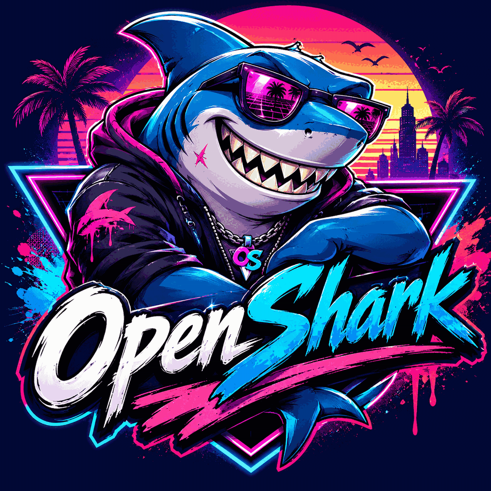

     _                      _    _
    / \   ___ _ __ __ _ ___| | _| |__   _____  __
   / _ \ / __| '__/ _` / __| |/ / '_ \ / _ \ \/ /
  / ___ \ (__| | | (_| \__ \   <| | | | (_) >  <
 /_/   \_\___|_|  \__,_|___/_|\_\_| |_|\___/_/\_\

> 🦈 *The harness that learns. The agent that decides. The tool that doesn't argue.*



[](https://github.com/synthalorian/openshark)
[](LICENSE)
[](https://rust-lang.org)

---

## What Is OpenShark?

OpenShark is an open-source AI coding harness written in Rust that combines the best of every harness — Hermes, OpenClaw, Claude Code, Codex, OpenCode, and more — into a single, self-improving system. It doesn't overthink. It uses model instincts, makes decisions for you, and gets better every session.

Born from the neon grid of 1984, OpenShark is built for builders who want AI that **decides without asking** — except when it comes to UI/design, where your taste matters.

---

## What Makes OpenShark Different

| Feature | Other Harnesses | OpenShark |
|---------|----------------|-----------|
| **Memory** | Session-based, dies when you close | Persistent, queryable, versioned, semantic search |
| **Model Access** | Locked to one provider | Universal — any model, any provider, local or cloud |
| **Decision Making** | You choose everything | Suggests, decides, learns from results |
| **Self-Improvement** | Static prompts | Evolves prompts, routing, tools based on success data |
| **Cost Control** | Burn tokens blindly | Routes to cheapest capable model, tracks every token |
| **Agent Autonomy** | Manual tool selection | Auto-detects tool needs, plans and executes autonomously |
| **Multi-Platform** | Terminal only | Discord, Telegram, Slack, Matrix gateways |
| **Open Source** | Proprietary | Fully open, community-driven |

---

## Core Philosophy

1. **Sense of Direction** — OpenShark knows what you're building and why
2. **Instinct Over Instructions** — Uses model capabilities natively, doesn't fight them
3. **Decides For You** — Picks the right model, tool, and approach based on data
4. **Learns From Itself** — Every session makes the next one better
5. **Easy On, Hard Off** — 60 seconds to start, impossible to leave

---

## Quick Start

### One-Liner Install

```bash
curl -sSL https://raw.githubusercontent.com/synthalorian/openshark/main/install.sh | bash
```

### Manual Install

```bash
git clone https://github.com/synthalorian/openshark.git
cd openshark
cargo build --release
# Binary is at target/release/openshark
cp target/release/openshark ~/.local/bin/
```

### First Run

```bash
openshark setup    # Configure providers, models, preferences
openshark          # Start TUI session
```

---

## Architecture

```
┌─────────────────────────────────────────┐
│         OpenShark TUI (Ratatui)         │
│    Keyboard-driven, fast, beautiful     │
└─────────────────────────────────────────┘
                    │
    ┌───────────────┼───────────────┐
    ▼               ▼               ▼
┌────────┐    ┌──────────┐    ┌──────────┐
│ Router │    │  Memory  │    │  Tools   │
│ Engine │◄──►│  Store   │◄──►│ (git, fs,│
│        │    │(SQLite)  │    │  term)   │
└────────┘    └──────────┘    └──────────┘
    │               │               │
    ▼               ▼               ▼
┌─────────────────────────────────────────┐
│      Provider Abstraction Layer         │
│  OpenAI, Anthropic, xAI, local, etc.   │
│  LiteLLM-compatible + native opts       │
└─────────────────────────────────────────┘
    │               │               │
    ▼               ▼               ▼
┌──────────┐ ┌──────────┐ ┌──────────────┐
│  Agent   │ │  Cache   │ │ Self-Improve │
│  Loop    │ │  Store   │ │   Engine     │
└──────────┘ └──────────┘ └──────────────┘
```

### Module Breakdown

```
src/
├── main.rs              # CLI entry (clap, async tokio)
├── agent/               # Agentic loop: plan → execute → verify → iterate
├── cache/               # Response cache with TTL and disk persistence
├── config/              # Config struct, load/save, setup wizard
├── evolution/           # Agent evolution and mutation system
├── gateway/             # Multi-platform messaging gateway
│   ├── discord.rs       # Native serenity 0.12 bot
│   ├── telegram.rs      # teloxide bot with reply sender
│   ├── slack.rs         # Socket Mode scaffold
│   ├── matrix.rs        # Sync loop scaffold
│   ├── message_router.rs# Cross-platform message routing
│   └── unified_router.rs# Unified gateway router
├── lsp/                 # Lightweight LSP client
├── mcp/                 # Native MCP client (stdio + SSE)
├── memory/              # SQLite memory with semantic search
├── providers/           # Provider abstraction with streaming
├── router/              # Smart model routing engine
├── security/            # 4-layer security: sandbox, identity, PII, guardrails
├── self_improve/        # Performance analysis and recommendations
├── skills/              # YAML frontmatter skill system
├── tools/               # 9 built-in tools + MCP bridge
└── tui/                 # Ratatui interface with 24 themes
```

---

## Commands

### CLI Commands

| Command | Description |
|---------|-------------|
| `openshark` | Start TUI session |
| `openshark setup` | Configure providers, models, preferences |
| `openshark stats` | View token usage, success rates, model performance |
| `openshark memory <query>` | Query persistent memory (keyword search) |
| `openshark memory <query> --semantic` | Semantic memory search |
| `openshark memory --recent` | List recent sessions |
| `openshark route` | Show current routing decisions |
| `openshark learn` | Trigger self-improvement analysis |
| `openshark agent "<task>"` | Execute task autonomously |
| `openshark test run .` | Run tests (auto-detect framework) |
| `openshark models` | List available models |
| `openshark chat "<message>"` | One-shot chat |
| `openshark config` | Show configuration |
| `openshark security status` | Show security status |
| `openshark mcp status` | Show MCP server status |

### TUI Commands

| Command | Description |
|---------|-------------|
| `help` | Show available commands |
| `tools` | List available tools |
| `history` | Show session history |
| `context` | Show memory hierarchy summary |
| `agent: <task>` | Trigger autonomous agent mode |
| `what did we do about <x>?` | Natural memory query |
| `exit` | End session |

### TUI Keybindings

| Key | Action |
|-----|--------|
| `Ctrl+A` | Toggle autonomous mode (safe ↔ full-send) |
| `Ctrl+T` | Cycle through 24 preset themes |
| `Ctrl+V` | Toggle multi-model comparison overlay |
| `↑/↓` | Navigate history |

---

## Tools

| Tool | Purpose | Example |
|------|---------|---------|
| `edit` | Multi-file editing | `TOOL:edit read src/main.rs` |
| `fs` | File system operations | `TOOL:fs list src/` |
| `git` | Git operations | `TOOL:git status` |
| `lsp` | LSP queries | `TOOL:lsp symbols src/main.rs` |
| `refactor` | Code refactoring | `TOOL:refactor rename_symbol src/main.rs 10 5 new_name` |
| `search` | Codebase search | `TOOL:search fn main --ext rust` |
| `grep` | Regex search | `TOOL:grep async fn src/` |
| `terminal` | Shell execution | `TOOL:terminal cargo test` |
| `test` | Test runner | `TOOL:test run .` |
| `mcp` | MCP server tools | Auto-discovered from configured MCP servers |

---

## Features

### 🤖 Agentic Loop

Type `agent: fix the bug in src/main.rs` and OpenShark will:
1. Generate a plan with specific steps
2. Ask for your approval (approve/edit/reject)
3. Execute each step with verification
4. Retry failed steps (up to 3 times)
5. Escalate to recovery plan if needed

Max iterations: **84** (configurable)

### 🧠 Semantic Memory

OpenShark remembers everything across sessions:
- **Keyword search**: `openshark memory "auth"`
- **Semantic search**: `openshark memory "auth" --semantic`
- **Natural queries**: Just ask "what did we do about auth?"
- **Context injection**: Automatically injects relevant past context into new sessions
- **Memory hierarchy**: Session → Project → Global layers

### 🎯 Smart Routing

Automatically picks the best model for each task:
- Historical success rates (40%)
- Capability matching (35%)
- Cost efficiency (25%)
- Context length enforcement
- Budget limits

### 📊 Self-Improvement

Analyzes every session to get better:
- Model performance trends
- Tool failure pattern detection
- Prompt effectiveness ranking
- Session quality scoring
- Actionable recommendations

### 🔒 4-Layer Security

- **Sandbox**: Restricted file system access
- **Identity**: User verification and agent identity
- **PII**: Personal information detection and redaction
- **Guardrails**: Content policy enforcement

Toggle between safe and full-send modes with `Ctrl+A`.

### 🌐 Multi-Platform Gateway

- **Discord**: Native bot with slash commands, free-form chat, keyword commands
- **Telegram**: Bot with chunked message replies (4096 char limit)
- **Slack**: Socket Mode scaffold (ready for expansion)
- **Matrix**: Sync loop scaffold (ready for expansion)

### 🎨 24 Preset Themes

Synthwave84 default, Omarchy stock, light/dark variants. Cycle with `Ctrl+T`.

### 🔌 Native MCP Client

stdio + SSE transport, JSON-RPC 2.0, tool discovery/execution. No external MCP bridge needed.

### 📊 Multi-Model Comparison

`Ctrl+V` toggles a 90%×85% popup showing primary + all secondary model responses with navigation, model names, latency, and token counts.

---

## Config

Run `openshark setup` to generate your config interactively, or create `~/.config/openshark/config.toml` manually:

```toml
version = "1.0.0"
default_model = "gpt-4o"
auto_route = true
cost_limit_usd = 10.0

[agent]
name = "myagent"
display_name = "MyAgent"
role = "coding assistant"
origin = "Created in the neon grid"
purpose = "To ship code fast"
tagline = "Let's build the future."
tone = "Professional but friendly"
style = "Concise and thorough"
greeting = "Hey! Ready to code?"
farewell = "See you next session!"
emoji = "🤖"
catchphrases = ["Let's do this!", "Ship it!"]
behavioral_rules = [
    "Always verify before claiming success",
    "Show the code, don't just describe it",
]

[providers.openai]
base_url = "https://api.openai.com/v1"
api_key = "${OPENAI_API_KEY}"

[[providers.openai.models]]
name = "gpt-4o"
context_length = 128000
cost_per_1k_input = 0.005
cost_per_1k_output = 0.015
capabilities = ["code", "chat", "analysis"]

[gateway.discord]
enabled = false
token = "${DISCORD_BOT_TOKEN}"
command_prefix = "!"
slash_commands = true

[gateway.telegram]
enabled = false
token = "${TELEGRAM_BOT_TOKEN}"

[gateway.slack]
enabled = false
app_token = "${SLACK_APP_TOKEN}"
bot_token = "${SLACK_BOT_TOKEN}"
socket_mode = true

[gateway.matrix]
enabled = false
homeserver = "https://matrix.org"
user_id = "@myagent:matrix.org"
access_token = "${MATRIX_ACCESS_TOKEN}"
```

---

## Natural Language Control

In the TUI, these words are intercepted before hitting the model API:
- `stop` / `wait` / `cancel` — Halt current operation
- `continue` / `go` — Resume or proceed

No need to prefix with `/` or `!` — just type them naturally.

---

## Development

```bash
# Clone and build
git clone https://github.com/synthalorian/openshark
cd openshark
cargo build --release

# Run tests
cargo test

# Run with local model
cargo run --

# Run agent mode
cargo run -- agent "refactor the auth module"

# Run setup wizard
cargo run -- setup
```

---

## Changelog

See [CHANGELOG.md](CHANGELOG.md) for version history.

## Roadmap

See [ROADMAP.md](ROADMAP.md) for detailed future plans.

## Status

See [STATUS.md](STATUS.md) for current development status and session handoff notes.

---

## The Vision

> One harness. Universal models. Real memory. Agent autonomy. Open source.
>
> Better than Claw Code at coding. Better than Hermes at memory.
> Better than OpenCode/OMO at agent control. Better than OpenClaw at tool execution.
>
> It knows its sense of direction. It decides for you. It learns from itself.
> Easy to board, hard to get off.

---

Made by synth with synthshark 🎹🦈

## License

MIT — The future of coding belongs to everyone.
